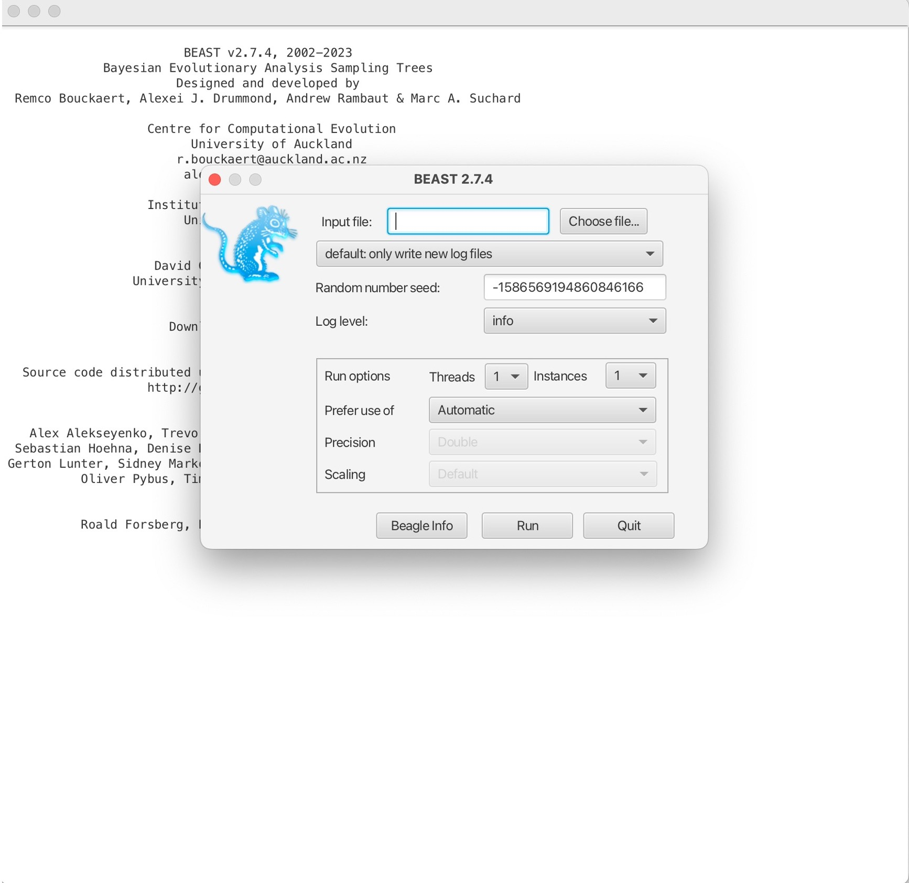
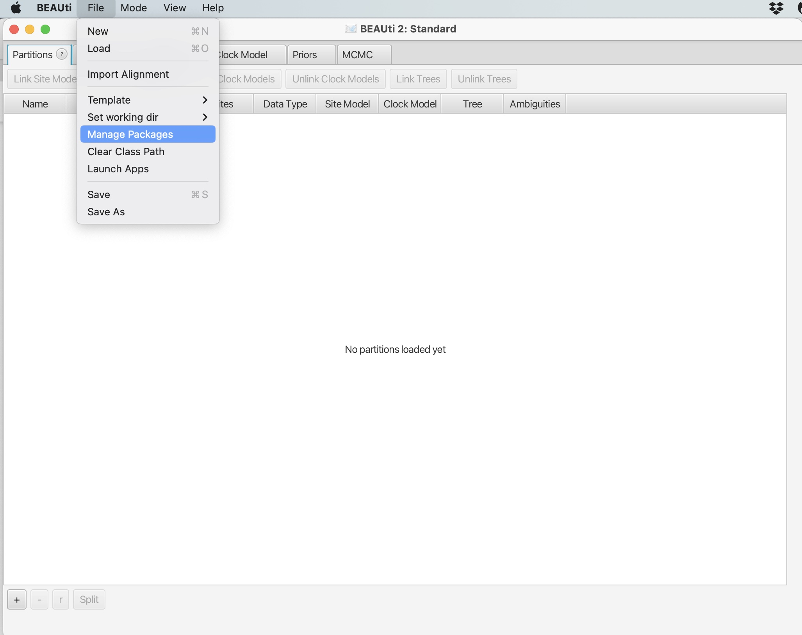

# Bayesian reconstruction of timed trees with BEAST2

BEAST (Bayesian Evolutionary Analysis Sampling Trees) is a powerful software package widely used for inferring time-measured phylogenies from molecular sequence data. It employs a Bayesian framework to simultaneously estimate phylogenetic trees, evolutionary parameters, and divergence times, allowing researchers to integrate molecular sequence data with temporal information to reconstruct the evolutionary history of species and pathogens. BEAST is particularly valuable for timed phylogeny building due to its ability to model complex evolutionary processes, account for uncertainty in phylogenetic inference, and incorporate prior knowledge about the evolutionary rates and divergence times.

One of the key features that makes BEAST an important tool for timed phylogeny building is its flexibility in modeling evolutionary processes. BEAST allows users to specify sophisticated evolutionary models, including substitution models, molecular clock models, demographic models, and phylogeographic models, tailored to the specific characteristics of the data and the biological question of interest. Additionally, BEAST provides rigorous statistical methods, such as Bayesian Markov Chain Monte Carlo (MCMC) sampling, for estimating posterior distributions of model parameters, allowing for the quantification of uncertainty in the inferred phylogenies and divergence times. Overall, BEAST's combination of flexibility, sophistication, and statistical rigor makes it an indispensable tool for timed phylogeny building and advancing our understanding of evolutionary history across diverse taxa.

The data we will be using in this exercise are:

- **TB_Cluster.fasta** – A FASTA alignment file of concatenated SNPs from 38 _M. tuberculosis_ samples collected between 2005 - 2014 in British Columbia. These isolates all share a MIRU-VNTR type, suggesting they may be linked by transmission.

- **TB_Cluster.txt** – A text file with two columns, the name of the 38 _M. tuberculosis_ samples and their collection dates.

 

To run BEAST2, we first need to create XML file in BEAUti that can be read by the main tool - BEAST. BEAUti is included in the BEAST2 suite of software. BEAUti can also be run using the command line but here we will take you through the user interface.  

### Open BEAUti:

 

### 1. You will open the following screen. Click the + sign illustrated by the red box:

    

### 2. Navigate to the "TB_Cluster.fasta" file in your data folder and click open. You will then be prompted to choose the datatype, we will select "all are nucleotide":

Other types of data can be included, such as binary character data, and multiple data sources for the same samples can be used together with different models applied. For example, you could use SNPs in the form of nucleotides and the presence/absence of indels as binary data to estimate the phylogeny, with different evolutionary models applied to each type of data.

 

### 3. This will load the data into BEAUti. These are called 'partitions' and you can have multiple input datasets (e.g., SNPs and Indels). Here we are just using SNPs, the arrows below point to the key information on this screen:

 

### 4. Next, we will load in the date information. Click the 'Tip Dates' tab shown in the red box below:

 

### 5. Dates may be in various formats, and can also be contained in the sequence names or in a separate file. Here, we have are dates in the text file "TB_Cluster.txt" in the yyyy-M-dd format. So first we need to click the 'as dates with format' button and select the correct date format, then click 'Auto-configure':

 

### 6. Select 'read from file' and click the 'Browse' button to find the dates file in your data folder:

 

### 7. This will bring up the dates of each sample in the middle column and the distance to the most recent sequence in unit time:

 

### 8. Next, we will navigate to the 'Site Model' tab to select our nucleotide substitution model. Here we want to use GTR but other models are available:

 

### 9. The 'Clock Model' tab will allow us to pick a molecular clock model. 

This can be set to 'strict' if you believe that the molecular clock is constant across all branches of the tree or relaxed if you want a more flexible model that allows for clock rates to vary across branches of the tree. Here we can also set a prior value for our molecular clock in the box below. To read more about molecular clocks see [here](https://www.sciencedirect.com/topics/immunology-and-microbiology/molecular-clock):

 

### 10. The last evolutionary model to choose is the Tree model, in the 'Priors' tab.This can be changed using the dropdown menu at the top. 

This parameter sets the population demographic model, which are used to infer historical changes in population size over time based on molecular sequence data. These models allow researchers to estimate parameters related to population dynamics, such as changes in effective population size, population growth rates, demographic bottlenecks, and migration rates. 

Here we will set the population model as 'Coalescent Constant Model'. Please read more about the different population demographic models [here](https://beast.community/tree_priors).

 

### 11. The last parameter to set is in "MCMC" tab. Here we can set the number of chains to run, which is the number of MCMC iterations to run the model for. Here we can set the number of MCMC chains to 1 million, this should take a few minutes to run. 

The number of chains to run the model for is dependent on the complexity of the data and the underlying models; longer runs with more likely lead to the MCMC chains to converge (reach an equilibrium):

 

### 12. Finally, we need to save the XML file by selecting 'File' and 'Save As'. Save your file as "TB_Cluster.xml":

 

### Now we have our XML file saved, we can open the BEAST program:

 

### 1. BEAST will look like this:

 

### 2. Load in your XML file into the Input file section and choose the number of threads to use:

 

### 3. Next, we can run BEAST by clicking 'Run'. This will start the BEAST run to output a posterior collection of trees that will produced at intervals through the MCMC iterations:

 

### You should find that 3 files are created: TB_Cluster.log, TB_cluster.trees, and TB_Cluster.xml.state. We want to inspect how well our run has converged using the .log file. We can use 'Tracer' to analyze the output from BEAST.

### Open Tracer:

 

### 1. You will open the following screen. Click the + in the red box and open the "TB_Cluster.log" file.

 

### 2. This will bring up all of the posterior estimates of different parameters. Your results will look slightly different to these, and to each other, as BEAST is a stochastic program:

 

### 3. You can also view the traces of each parameter to see how well the MCMC has converged:

Convergence refers to the property of an MCMC algorithm whereby it reaches a stationary distribution that accurately represents the posterior distribution of the model parameters. In simpler terms, it indicates that the chain has explored the parameter space sufficiently and is sampling from the true underlying distribution.

 

_Discussion: What parameters do you think have not converged. What may be the reason? View the log file provided in the Data folder "TB_Cluster_longer.log. How do these traces compare to your runs?_

 

### Finally, we can create a single consensus tree using 'TreeAnnotator' from the posterior distribution of trees found in the "TB_Cluster.trees" file:

### Open TreeAnnotator:

 

### 1. Here will first select the percentage burn-in. This is initial portion of the MCMC chain where samples are discarded, removing any influence of the starting values on the estimation of posterior distributions. We will also open the TB_Cluster.trees file in the 'Input tree file' box, and name our single output tree in the 'Output file' box. We can name this "TB_Cluster.tree":

 

### 2. Then click 'Run' to estimate a single consensus tree from the posterior output from BEAST. This will be saved in the "TB_Cluster.tree" file:

 

### 3. Open the "TB_Cluster.tree" file in FigTree:

 

### 4. Explore the options on the bottom left to look at the estimated times of the nodes:

_Question: How far in the past is the TMRCA (time to most recent common ancestor) of all the samples in our cluster?_

 

# Phylodynamics with BEAST2

Along with inferring timed phylogenies, we can use BEAST (Bayesian Evolutionary Analysis Sampling Trees) to carry out a range of phylogenetic and phylodynamic analyses. BEAST2 is a newer and more advanced version of BEAST, developed by the same team but with a redesigned architecture to provide a modular and extensible framework. As such, there are a variety of packages available in BEAST2 that have been developed for a range of different analyses, such as jointly reconstructing transmission networks with a phylogeny and inferring recombination. Furthermore, BEAST2 allows users to write their own packages to use their underlying Bayesian architecture, as well as providing [tutorials](https://www.beast2.org/package-development-guide/writing-a-beast-2_7-package.html) to write these packages.

Here, we will run a phylodynamics analysis using the BEAST2 package 'BDSKY' to infer past population dynamics of our TB cluster.
 

### Open BEAUti:

### 1. Click file -> Manage Packages:

    

### 2. Scroll down and select the 'BDSKY' package. Click "Install/Upgrade:

    

### This will download the package. You should get a prompt stating it has been successfully installed but that it will need to be restarted for any changes to take effect. Please restart BEAUti.

### 3. Now load in the data, set the tip dates and set up the site model and clock model as before.

    

### 4. The difference in this analysis will be when setting up the tree model. Here we want to select the 'Coalescent Bayesian Skyline' option.

    

### 5. Set the number of MCMC iteration to 10 million for this analysis and save the file, it should take around 5 minutes to run.

    

### 6. Run your new XML file in BEAST in the same way as before.

    

### 7. Open Tracer and view your log file. It should hopefully have reached convergence or near convergence at all parameters. We can now view the results of Skyline analysis. Click 'Analysis -> Bayesian Skyline Reconstruction':

   

### 8. In the 'Trees Log File' option, load in the resulting .trees file from your BEAST run. We can also set the age of the youngest tip as 2014.6 as we know our most recent sample was collected in July 2014. Press okay to run the analysis:

   

### 9. We now have our skyline plot showing an estimate of the past population demography:

   

### Questions: 

### 1. How do we interpret this plot?
### 2. What can we say about the trajectory of our TB outbreak?

 

### Further resources: 

BEAST is very well documented with numerous basic and advanced tutorials. The excellent ['Taming the BEAST'](https://taming-the-beast.org/tutorials/Introduction-to-BEAST2/) workshop has many different walkthoughs and tutorials to guide you through all aspects of runnnig BEAST.

In addition, BEAST2 contains many other packages and analysis types that you can explore. Again the Taming the BEAST workshop is a great resource to learn more, including this [tutorial on skyline plots.](https://taming-the-beast.org/tutorials/Skyline-plots/)

