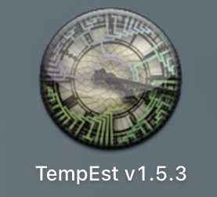
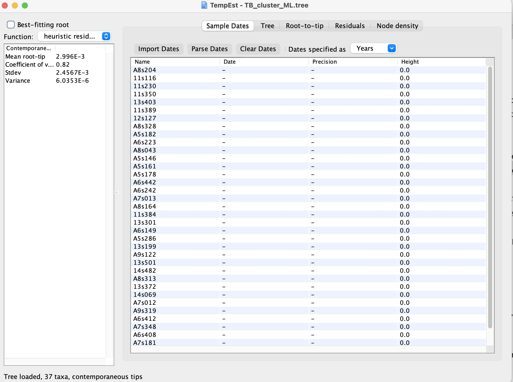
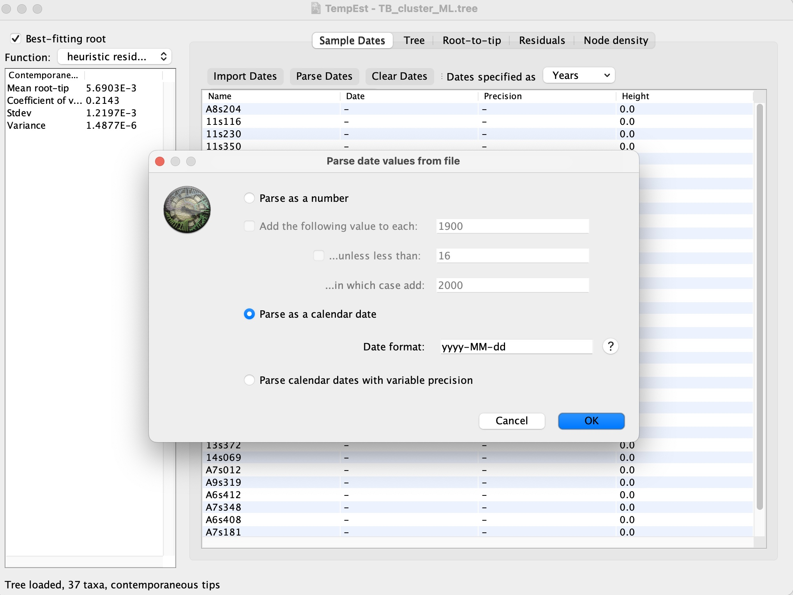
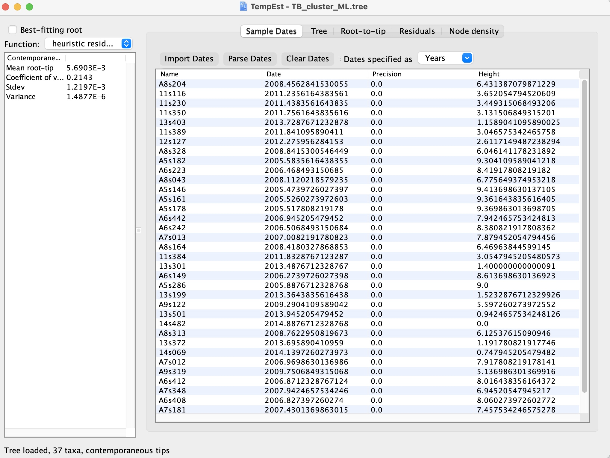
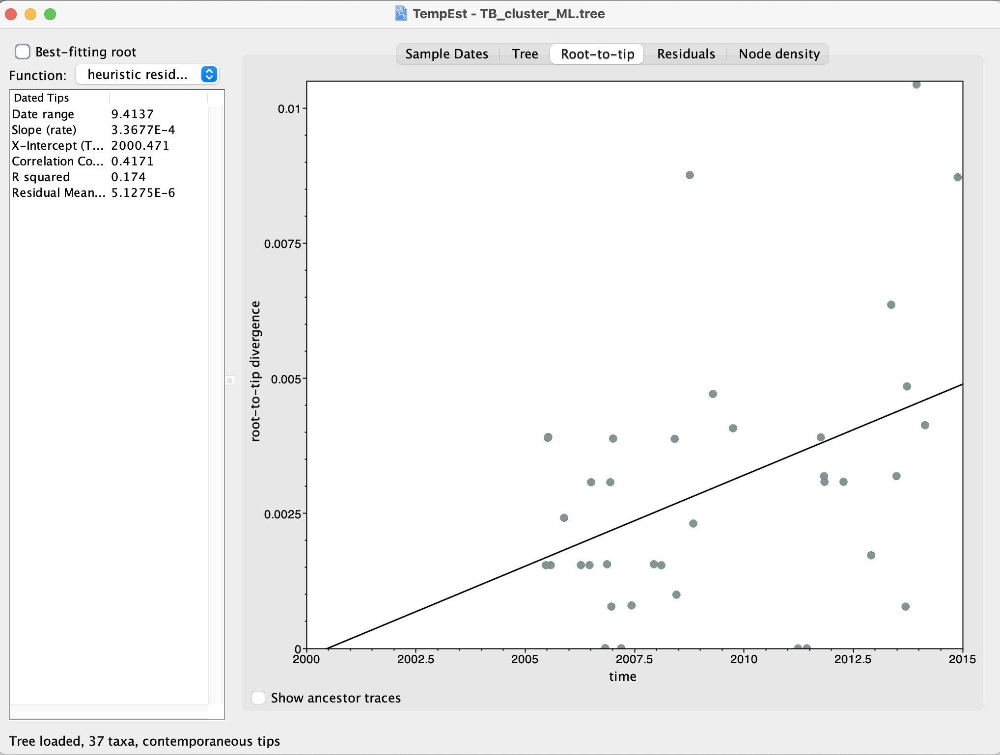

# Inspecting the temporality of sequences using TempEst

Before building a timed phylogeny, it can be important to test for temporality in your data. Temporality in this context refers to the presence of a molecular clock signal, meaning that genetic changes accumulate at a roughly consistent rate over time. This is essential for reliably estimating divergence times in a phylogenetic tree. This analysis can inform the clock model to select when building a timed phylogeny or identify sequences that may be problematic, such as those with incorrect dates or significant rate variation.

Tools like [TempEst](http://tree.bio.ed.ac.uk/software/tempest/) can be used to plot the root-to-tip distances for each sequence from an un-timed phylogeny against sequence dates. In a dataset where a molecular clock holds, you would expect a positive correlation between these distances and time.

The data we will be using in this exercise are:

- [**TB_cluster_ML.tree**](https://drive.google.com/uc?export=download&id=1FRyfCeEqqIPoRLB81JJYyBomqORJG7fS) – A Maximum Likelihood phylogeny from 37 _M. tuberculosis_ samples collected between 2005 - 2014 in British Columbia. This is an untimed phylogeny so the branches will be in units of substitutions/site. This tree has been rooted by an outgroup sequence that has been removed.

- [**TB_cluster.txt**](https://drive.google.com/uc?export=download&id=1kR8uE2pmGGBsH5UbxPdhvnkQJNPLe78I) – A text file with two columns, the name of the 37 _M. tuberculosis_ samples and their collection dates.

### Open TempEst:

 

### 1. You will be prompted to open a file, select the TB_cluster_ML.tree file. This will open the following screen:

    

### 2. Select Import Dates and open the "TB_cluster.txt" file to import the dates. This will prompt the following screen to parse the dates in the correct format. The dates are in the "yyyy-MM-dd" format so we can select that:

 

### 3. This will load the data into BEAUti. These are called 'partitions' and you can have multiple input datasets (e.g., SNPs and Indels). Here we are just using SNPs, the arrows below point to the key information on this screen:

 

### 4. Next, we will load in the date information. Click the 'Tip Dates' tab shown in the red box below:

 

